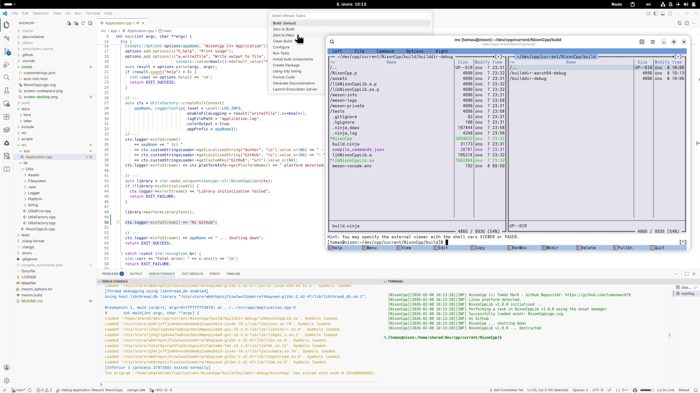
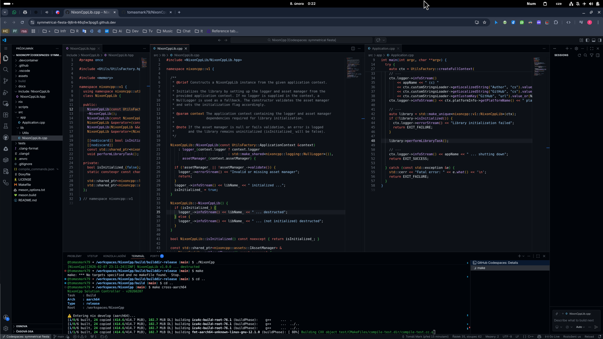

DotNameBot
========

<!-- [](https://github.com/tomasmark79/DotNameBot/actions/workflows/ci.yml) -->

<p align="center">
  
</p>

A self-hosted Discord bot written in C++20. Aggregates RSS/ATOM feeds, tracks crypto prices, renames channels, and publishes a self-contained HTML feed page.

Features
--------

**RSS/ATOM aggregation**
- Fetches and deduplicates items across runs (SHA-256 hashes persisted in `seenHashes.json`)
- Supports RSS 2.0 and ATOM feeds; decodes HTML entities and transcodes non-UTF-8 feeds (iconv)
- Per-channel feed filtering — each Discord channel sees only its own subscribed feeds
- Configurable feed labels; falls back to domain name when no label is set

**Slash commands**

| Command | Description |
|---|---|
| `/rss_add` | Subscribe a feed URL to a channel |
| `/rss_remove` | Unsubscribe a feed URL |
| `/rss_list` | List feeds for the current channel |
| `/rand` | Post a random item from the feed buffer |
| `/rename_channel` | Trigger an immediate channel rename |
| `/btcprice` | Show current BTC/USD price |
| `/ethprice` | Show current ETH/USD price |

**Background timers**
- RSS refetch every hour; posts new items automatically
- Channel rename every 2 hours (random adjective + noun from asset files)
- BTC/ETH price in bot presence every 5 minutes, with EMA trend detection (short=3, long=12 periods)

**HTML feed output**
- After each RSS fetch a self-contained `feeder.html` is written next to the data files (`assets/`)
- Light theme, fixed sidebar with per-source navigation and item counts
- Items sorted newest-first per section; previous file backed up with a timestamp suffix

Repository layout
-----------------

- `src/app/`     Application entry point and lifecycle wiring
- `src/lib/`     Bot logic (DiscordBot, RssManager, HtmlFeedWriter, Crypto, Utils…)
- `tests/`       Google Test unit and live-feed tests
- `assets/`      Runtime data files (feed URLs, seen hashes, emoji list, word lists)

Requirements
------------

- Nix (recommended) or a C++20 toolchain + Meson + Ninja
- Optional: doxygen + graphviz for docs

Quick start (Nix)
-----------------

If you use `direnv`:

```bash
direnv allow
```

Build (native, release):

```bash
make build
```

Run tests (native, debug build first):

```bash
make test
```

Build and test
--------------

```bash
make build        # Native release build
make debug        # Native debug build
make test         # Run tests
make format       # clang-format on sources
make check        # clang-tidy (native debug builddir)
```

Cross builds
------------

```bash
make cross-aarch64
make cross-windows
make cross-wasm
```

Packaging
---------

```bash
make package-native
make package-aarch64
make package-windows
make package-wasm
```

Nix package
-----------

Build the project as a proper Nix package (reproducible, isolated, Nix store output):

```bash
make nix-build        # shortcut for: nix build ./nix#DotNameBot
```

The result is available as a symlink `./result` pointing into the Nix store:

```
result/bin/DotNameBot
result/lib/libDotNameBotLib.*
result/include/DotNameBotLib/
```

Nix shell GC pinning
--------------------

By default, `nix-collect-garbage` can remove cross-compilation toolchains
(aarch64, Windows, WASM) from the Nix store, forcing a full re-download on
the next build. Pin all dev shells as GC roots to prevent this:

```bash
make pin-shells       # run once after cloning, and after 'nix flake update'
```

This creates symlinks `build/.gcroot-shell-{default,aarch64,windows,wasm}`
that act as GC roots – as long as they exist, the garbage collector will
never remove the referenced store paths.

> **Note:** The WASM shell uses a pinned nixpkgs commit (for Emscripten
> compatibility) and may take longer to download on the very first run.

Documentation
-------------

- Online docs: <https://tomasmark79.github.io/DotNameBot/html/index.html>
- Generate locally:

```bash
make doxygen
```

Output: `docs/html/index.html`

VS Code tasks
-------------

<p align="center">
 <a href="./assets/screen-desktop.png">
  
 </a>
</p>

Workspace tasks are defined in [.vscode/tasks.json](.vscode/tasks.json).

How to run:

- Use `Terminal: Run Task` (or `Tasks: Run Task`) and pick one of the tasks below.

Common tasks:

- `Direct Build (native debug)` (default build task)
- `Project Build Tasks` (interactive picker: Build/Configure/Test/Package + arch + buildtype)
- `clang-format`
- `clang-tidy`
- `Launch Application (native)` / `Launch Application (native release)`
- `Launch Emscripten Server` / `Launch Emscripten Server (release)`

Optional keybindings:

- A suggested keybinding setup is provided in [.vscode/keybindings.json](.vscode/keybindings.json).
- Copy it into your user keybindings file (Linux default: `~/.config/Code/User/keybindings.json`).

GitHub Codespaces
-----------------

<p align="center">
 <a href="./assets/screen-codespace.png">
  
 </a>
</p>

This repo is Codespaces-ready via a devcontainer using Nix.

- Ensure the devcontainer is used: [.devcontainer/devcontainer.json](.devcontainer/devcontainer.json)
- After the container is created, the post-create step prefetches the Nix dev shell.
- Build + test as usual:
  - `make debug`
  - `make test`

Notes:

- WebAssembly dev server uses port `6931` (auto-forwarded by the devcontainer).
- Native builds can work without Nix if you install Meson/Ninja + a C++20 toolchain, but cross builds require Nix.

Configure Meson options
-----------------------

Example (debug builddir):

```bash
meson configure build/builddir-debug -Dbuild_tests=enabled
```

License
-------

MIT
